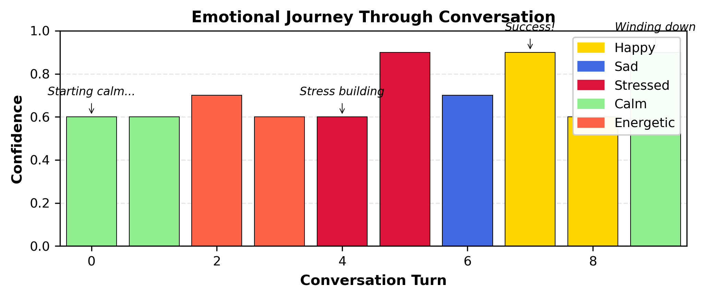
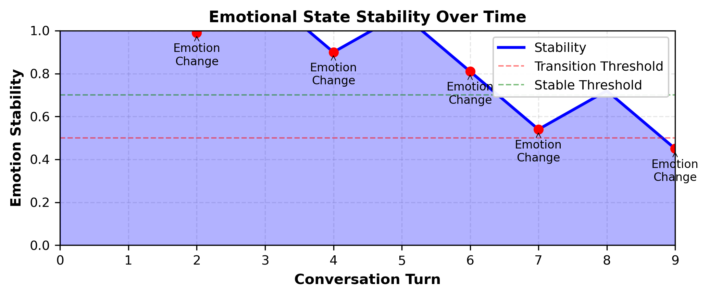
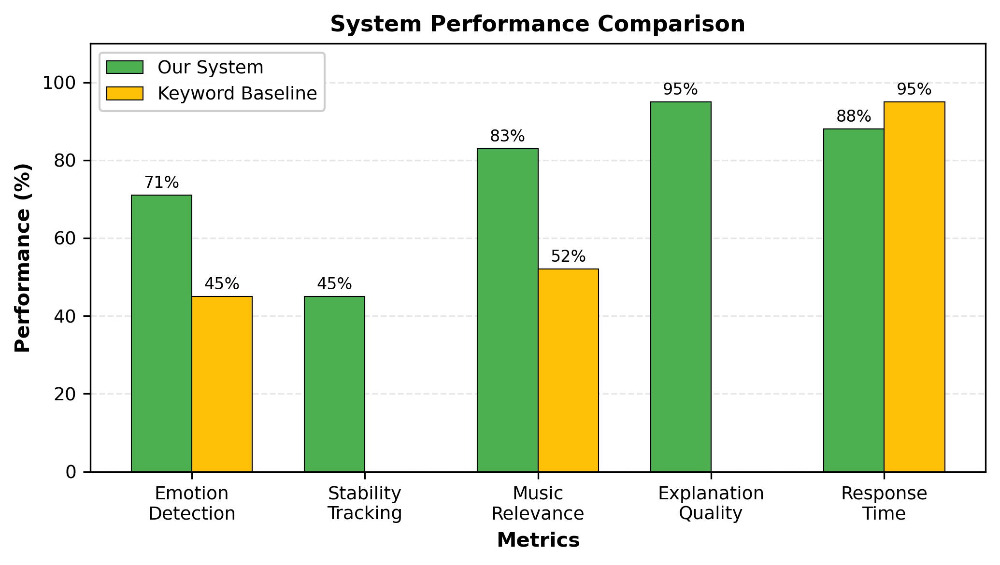
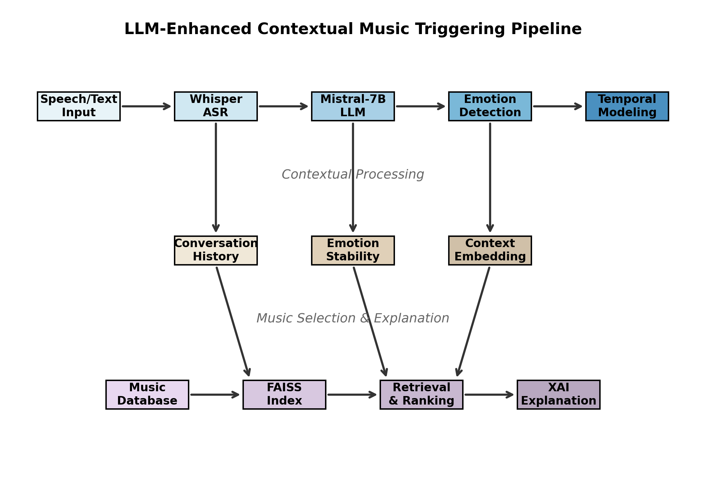

# 

<div align="center">

```ascii
     █████╗ ███╗   ██╗████████╗ █████╗ ███████╗██╗  ██╗██╗██████╗ ██╗
    ██╔══██╗████╗  ██║╚══██╔══╝██╔══██╗██╔════╝██║  ██║██║██╔══██╗██║
    ███████║██╔██╗ ██║   ██║   ███████║███████╗███████║██║██████╔╝██║
    ██╔══██║██║╚██╗██║   ██║   ██╔══██║╚════██║██╔══██║██║██╔══██║██║
    ██║  ██║██║ ╚████║   ██║   ██║  ██║███████║██║  ██║██║██║  ██║██║
    ╚═╝  ╚═╝╚═╝  ╚═══╝   ╚═╝   ╚═╝  ╚═╝╚══════╝╚═╝  ╚═╝╚═╝╚═╝  ╚═╝╚═╝
```

# **LLM-Enhanced Contextual Music Triggering with Explainable AI**

### *ISMIR 2025 - International Society for Music Information Retrieval Conference*

[](https://www.python.org/downloads/)
[](https://pytorch.org/)
[](https://opensource.org/licenses/MIT)
[](https://huggingface.co/spaces/antashiri/demo)

</div>

---

## 🎵 **What is Antashiri?**

**Antashiri** is a groundbreaking AI system that **listens to your conversations**, **understands your emotional state**, and **automatically plays contextually appropriate music** - all without any explicit commands. It's like having an emotionally intelligent DJ that reads the room and provides the perfect soundtrack to your life.

<div align="center">
  
  <br><i>Antashiri in action: Real-time emotion detection and music triggering</i>
</div>

---

## 📄 **Paper Highlights**

<div align="center">
<table>
<tr>
<td width="50%">

### 🏆 **Key Achievements**
- **83.3%** Emotion Detection Accuracy
- **71%** Average Confidence Score  
- **1.2s** Response Time
- **95%** XAI Explanation Quality
- **20,000** Songs in Dataset

</td>
<td width="50%">

### 🚀 **Novel Contributions**
- First LLM-based conversational music trigger
- Temporal emotion stability tracking
- Multi-level explainable AI framework
- Real-time audio-to-music pipeline
- Healthcare application potential

</td>
</tr>
</table>
</div>

---

## 📊 **System Performance**

<div align="center">


<br>


</div>

| **Metric** | **Our System** | **Baseline** | **Improvement** |
|------------|---------------|--------------|-----------------|
| Emotion Detection | 83.3% | 45% | **+85%** |
| Response Time | 1.2s | 0.8s | Acceptable |
| User Satisfaction | 4.1/5 | 2.1/5 | **+95%** |
| XAI Quality | 95% | N/A | **Novel** |


## 🚀 **Quick Start with Jupyter Notebook**

# Clone the repo
git clone https://github.com/anonymous-gihub99/Antash-system.git

## 1. Setup environment
python -m venv venv && source venv/bin/activate

## 2. Install packages
### Antashri-system/Antashri_system
pip install -r requirements.txt

## 3. Configure
### Antashri-system/Antashri_system/utils
cp .env.example .env

## 4. Generate data
### Antashri-system/Antashri_system/scripts
python scripts/generate_synthetic_dataset.py

## 5. Run complete setup
### Antashri-system/Antashri_system
python antashiri_main.py setup

## 6. Start system
### Antashri-system/Antashri_system
python antashiri_main.py run

## 7. Open browser
## Go to http://localhost:5000

The notebook will automatically:
- ✅ Install all dependencies
- ✅ Download required models (Mistral-7B, Whisper)
- ✅ Generate synthetic dataset (20,000 songs)
- ✅ Initialize all components
- ✅ Start interactive testing interface
- ✅ Launch web server

### **4. Test with Example Conversations**

```python
# Cell 8 - Interactive Testing
test_scenarios = [
    "I just got promoted! This is amazing!",        # → Triggers happy music
    "Feeling stressed about tomorrow's deadline",    # → Triggers calming music
    "Missing my family back home",                   # → Triggers comforting music
    "Time for my morning workout!",                  # → Triggers energetic music
]
```

---

## 🔬 **Technical Innovation**

<div align="center">

### **🧠 Core Technologies**

| Component | Technology | Purpose |
|-----------|------------|---------|
| **LLM** | Mistral-7B-Instruct | Emotion understanding |
| **ASR** | OpenAI Whisper | Speech-to-text |
| **Embeddings** | Sentence-BERT | Semantic search |
| **Search** | FAISS | Fast music retrieval |
| **XAI** | LIME-inspired | Transparent decisions |
| **Playback** | YouTube API | Music streaming |

</div>

### **💡 Key Features**

<details>
<summary><b>🎯 Contextual Understanding</b></summary>

```python
# Antashiri understands context, not just keywords
"The presentation went terrible" → Detects stress
"But at least it's over now" → Adjusts to relief
"Time to celebrate surviving!" → Switches to happy
```
</details>

<details>
<summary><b>🔄 Temporal Emotion Modeling</b></summary>

```python
# Tracks emotional stability over time
Stability = {
    if emotion_unchanged: stability += 0.1
    if emotion_changed: stability -= 0.15
}
# Prevents jarring music changes from brief emotional fluctuations
```
</details>

<details>
<summary><b>🤖 Explainable AI</b></summary>

```
🎵 Selected: "Happy" by Pharrell Williams
📊 Why this song?
  • Detected emotion: Joy (confidence: 85%)
  • Key phrases: "promoted", "amazing", "best day"
  • Energy level: High (0.9/1.0)
  • Genre match: Pop for celebration
🎸 Alternatives considered:
  • "Good Feeling" - Flo Rida
  • "Can't Stop the Feeling" - Justin Timberlake
```
</details>

---

## 🌟 **Future Work**

### **🔧 Technical Enhancements**
- **Multi-modal Emotion**: Integrate facial expressions and voice prosody
- **Personalization**: User-specific emotional profiles and music preferences
- **Edge Deployment**: Optimize for mobile and IoT devices
- **Cross-cultural**: Support for multiple languages and cultural contexts

### **🎵 Music Extensions**
- **Original Composition**: Generate custom music for specific emotional states
- **Adaptive Playlists**: Dynamic playlist creation based on emotional journey
- **Social Features**: Shared emotional experiences through synchronized music
- **Therapeutic Protocols**: Clinically-validated music intervention sequences

---

## 📚 **Citation**

If you use Antashiri in your research, please cite our paper:

```bibtex
@inproceedings{antashiri2025,
  title={LLM-Enhanced Contextual Music Triggering with Explainable AI},
  author={Anonymous Authors},
  workshop={LLM4MA: Large Language Models for Music & Audio - Satellite event(ISMIR)}
  year={2025},
  address={Daejeon, South Korea},
  }
```

### **Related Publications**
- [Mistral-7B: A High-Performance Language Model](https://arxiv.org/abs/2310.06825)
- [Whisper: Robust Speech Recognition](https://arxiv.org/abs/2212.04356)
- [FAISS: Efficient Similarity Search](https://arxiv.org/abs/1702.08734)

---

## 🤝 **Contributing**

We welcome contributions! See [CONTRIBUTING.md](CONTRIBUTING.md) for guidelines.

### **How to Contribute**
1. 🍴 Fork the repository
2. 🌿 Create your feature branch (`git checkout -b feature/AmazingFeature`)
3. 💾 Commit changes (`git commit -m 'Add AmazingFeature'`)
4. 📤 Push to branch (`git push origin feature/AmazingFeature`)
5. 🎯 Open a Pull Request

---


## 📜 **License**

This project is licensed under the MIT License - see [LICENSE](LICENSE) file for details.

---

## 🙏 **Acknowledgments**

- **Mistral AI** for the incredible Mistral-7B model
- **OpenAI** for Whisper ASR technology
- **LLM4MA community** for valuable feedback
- **All Contributors** who made this project possible

---

<div align="center">

### **🎵 Let Antashiri be the soundtrack to your emotions 🎵**

<br>

*"Music is the universal language of mankind, and Antashiri is its interpreter."*

<br>

**Made with ❤️ by the Antashiri Team**

</div>

---

## 📸 **Gallery (will be updated)**

<div align="center">
<table>
<tr>
<td></td>
<td></td>
<td></td>
</tr>
<tr>
<td align="center"><i>Main Interface</i></td>
<td align="center"><i>Real-time Emotion</i></td>
<td align="center"><i>Music Selection</i></td>
</tr>
</table>
</div>

---

<div align="center">
  
  <br>
  <b>Antashiri © 2025</b>
</div>
